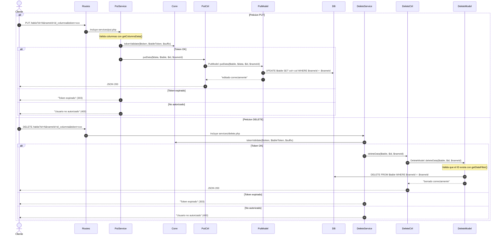

# Mapa de Flujo y Arquitectura de la API REST Dinámica

Esta arquitectura sigue el patrón **MVC (Modelo-Vista-Controlador)** adaptada para una API REST, donde:
- **Rutas (`routes/`):** Actúan como el "Tráfico", recibiendo la petición HTTP y decidiendo a qué servicio dirigirla.
- **Controladores (`controllers/`):** Actúan como el "Cerebro", recibiendo parámetros, controlando la lógica de negocio y comunicando las rutas con los modelos.
- **Modelos (`models/`):** Actúan como las "Manos", comunicándose directamente con la base de datos (BD) mediante consultas preparadas en PDO de forma segura.

## Referencia de Variables para Consultas SQL

| Variable | Referencia en SQL | Descripción |
| :--- | :--- | :--- |
| **`select`** | `SELECT ...` | Lista de columnas (separadas por coma) que quieres obtener de la base de datos. |
| **`table`** | `FROM ...` | El nombre de la tabla principal para la consulta. |
| **`rel`** | `JOIN ...` | Lista de tablas relacionadas (separadas por coma) para hacer `INNER JOIN`s. |
| **`type`** | `ON ...` | Define la lógica de los nombres de los campos de relación (foreign keys) en los `JOIN`. Genera: `tabla1.id_{type[n]}_{type[0]} = tablaN.id_{type[n]}` |
| **`linkTo`** | `WHERE ...` | El nombre de la columna que funcionará como filtro (`WHERE campo = ...`). |
| **`equalTo`** | `= ...` | El valor exacto que debe tener la columna definida en `linkTo`. |
| **`search`** | `LIKE ...` | El valor/palabra clave que se utilizará para buscar dentro de una columna (búsquedas parciales). |
| **`between1`** | `BETWEEN ... AND` | El valor inferior (límite inicial) para una búsqueda de rango. |
| **`between2`** | `... AND ...` | El valor superior (límite final) para una búsqueda de rango. |
| **`filterTo`** | `SELECT / WHERE` | Una columna adicional que se incluye para aplicar filtros complejos o rangos. |
| **`inTo`** | `IN (...)` | Filtrado utilizando una lista de valores permitidos (`WHERE columna IN (val1, val2)`). |
| **`orderBy`** | `ORDER BY ...` | La columna por la cual se ordenarán los resultados. |
| **`orderMode`** | `ASC/DESC` | El sentido del orden (`ASC` para ascendente, `DESC` para descendente). |
| **`startAt`** | `LIMIT ...` | El índice inicial para paginación. |
| **`endAt`** | `OFFSET ...` | La cantidad de registros a obtener en la paginación. |
| **`suffix`** | Nombre de columnas | Sufijo para nombrar columnas dinámicas: `id_{suffix}`, `email_{suffix}`, `password_{suffix}`, `token_{suffix}`, `token_exp_{suffix}`. |
| **`table` (token)** | Tabla de usuarios | Parámetro `&table=` para indicar dónde buscar el token. Default: `users`. |
| **`token`** | `WHERE token_{suffix} =` | Token JWT para autenticación en POST, PUT, DELETE. |

## Ciclo de Vida de una Petición GET (Request-Response)

```mermaid
sequenceDiagram
    autonumber
    actor Cliente as Cliente (Postman/Navegador)
    participant Index as index.php<br/>(Punto de Entrada)
    participant RoutesCtrl as routesController<br/>(controllers/routes.contoller.php)
    participant Routes as routes.php<br/>(routes/routes.php)
    participant GetService as get.php<br/>(routes/services/get.php)
    participant GetCtrl as GetController<br/>(controllers/get.controller.php)
    participant GetModel as GetModel<br/>(models/get.model.php)
    participant Conn as Connection<br/>(models/connection.php)
    database DB as Base de Datos

    Cliente->>Index: GET /tabla?select=col1,col2&linkTo=filtro&equalTo=valor
    Index->>RoutesCtrl: Crea instancia y llama a index()
    RoutesCtrl->>Routes: Incluye el enrutador principal
    Note over Routes: Evalúa la URL, extrae $table y el método HTTP

    alt Peticion GET con filtro (linkTo y equalTo, sin rel)
        Routes->>GetService: Incluye services/get.php
        GetService->>GetCtrl: getDataFilter($table, $select, $linkTo, $equalTo, ...)
        GetCtrl->>GetModel: GetModel::getDataFilter(...)
        GetModel->>Conn: Connection::connectDataBase()
        Conn->>DB: SELECT $select FROM $table WHERE $linkTo = :$linkTo
        DB-->>GetModel: Resultados
        GetModel-->>GetCtrl: Array de objetos
        GetCtrl->>GetCtrl: fncResponse() -> JSON
        GetCtrl-->>Cliente: JSON con status 200/404

    else Peticion GET sin filtro entre tablas relacionadas (rel y type)
        Routes->>GetService: Incluye services/get.php
        GetService->>GetCtrl: getRelData($rel, $type, $select, ...)
        GetCtrl->>GetModel: GetModel::getRelData(...)
        Note over GetModel: Genera INNER JOINs con ON<br/>tabla1.id_{type[n]}_{type[0]} = tablaN.id_{type[n]}
        GetModel->>Conn: Connection::connectDataBase()
        Conn->>DB: SELECT $select FROM $rel[0] INNER JOIN ... ON ...
        DB-->>GetModel: Resultados
        GetModel-->>GetCtrl: Array de objetos
        GetCtrl-->>Cliente: JSON con status 200/404

    else Peticion GET con filtro entre tablas relacionadas
        Routes->>GetService: Incluye services/get.php
        GetService->>GetCtrl: getRelDataFilter($rel, $type, $select, $linkTo, $equalTo, ...)
        GetCtrl->>GetModel: GetModel::getRelDataFilter(...)
        GetModel->>Conn: Connection::connectDataBase()
        DB-->>GetModel: Resultados
        GetModel-->>GetCtrl: Array de objetos
        GetCtrl-->>Cliente: JSON con status 200/404

    else Buscador sin relaciones (linkTo y search)
        Routes->>GetService: Incluye services/get.php
        GetService->>GetCtrl: getDataSearch($table, $select, $linkTo, $search, ...)
        GetCtrl->>GetModel: GetModel::getDataSearch(...)
        Note over GetModel: WHERE $linkTo LIKE '%$search%'
        DB-->>GetModel: Resultados
        GetModel-->>GetCliente: JSON

    else Buscador con relaciones
        Routes->>GetService: Incluye services/get.php
        GetService->>GetCtrl: getRelDataSearch($rel, $type, $select, $linkTo, $search, ...)
        GetCtrl->>GetModel: GetModel::getRelDataSearch(...)
        DB-->>GetModel: Resultados
        GetModel-->>GetCliente: JSON

    else Seleccion de rangos (between1 y between2)
        Routes->>GetService: Incluye services/get.php
        GetService->>GetCtrl: getDataRange(...)
        GetCtrl->>GetModel: GetModel::getDataRange(...)
        Note over GetModel: WHERE $linkTo BETWEEN '$between1' AND '$between2'

    else Sin filtro
        Routes->>GetService: Incluye services/get.php
        GetService->>GetCtrl: getData($table, $select, ...)
        GetCtrl->>GetModel: GetModel::getData(...)
        GetModel->>Conn: Connection::connectDataBase()
        Conn->>DB: SELECT $select FROM $table
        DB-->>GetModel: Resultados
        GetModel-->>GetCtrl: Array de objetos
        GetCtrl-->>Cliente: JSON con status 200/404
    end
```

## Ciclo de Vida de una Peticion POST (Registro y Login)

```mermaid
sequenceDiagram
    autonumber
    actor Cliente as Cliente
    participant Routes as routes.php
    participant PostService as services/post.php
    participant PostCtrl as PostController
    participant PostModel as PostModel
    participant GetModel as GetModel
    participant PutModel as PutModel
    participant Conn as Connection
    database DB as Base de Datos

    Cliente->>Routes: POST /tabla con datos $_POST

    alt Registro de usuario (?register=true)
        Routes->>PostService: Incluye services/post.php
        PostService->>PostCtrl: postRegister($table, $_POST, $suffix)
        Note over PostCtrl: Encripta password con crypt() si existe
        PostCtrl->>PostModel: PostModel::postData($table, $data)
        PostModel->>DB: INSERT INTO $table ...
        DB-->>PostModel: lastInsertId
        PostModel-->>PostCtrl: "todo bien"
        Note over PostCtrl: Si no envio password, se registra igual<br/>y se genera token JWT automaticamente
        PostCtrl->>GetModel: getDataFilter($table, '*', 'email_$suffix', $email)
        DB-->>GetModel: Datos del usuario
        GetModel-->>PostCtrl: Objeto usuario
        Note over PostCtrl: Genera token con Connection::jwt()
        PostCtrl->>PutModel: putData($table, [token, token_exp], $id, 'id_$suffix')
        PostCtrl-->>Cliente: JSON con datos + token

    else Login de usuario (?login=true)
        Routes->>PostService: Incluye services/post.php
        PostService->>PostCtrl: postLogin($table, $_POST, $suffix)
        PostCtrl->>GetModel: getDataFilter($table, '*', 'email_$suffix', $email)
        DB-->>GetModel: Datos del usuario
        Note over PostCtrl: Verifica password con crypt()
        alt Password correcto
            PostCtrl->>PostCtrl: Genera nuevo token JWT
            PostCtrl->>PutModel: putData($table, [token, token_exp], $id, 'id_$suffix')
            PostCtrl-->>Cliente: JSON con datos + token
        else Password incorrecto
            PostCtrl-->>Cliente: "clave errada"
        else No envio password
            PostCtrl-->>Cliente: "Ingrese la contrasena"
        end

    else POST con token (?token=xxx&table=users&suffix=user)
        Routes->>PostService: Incluye services/post.php
        PostService->>Conn: tokenValidate($token, $tableToken, $suffix)
        Conn->>GetModel: getDataFilter($table, 'token_exp_$suffix', 'token_$suffix', $token)
        DB-->>GetModel: Usuario por token
        alt Token OK
            PostService->>PostModel: PostModel::postData($table, $data)
            DB-->>PostModel: lastInsertId
            PostModel-->>Cliente: JSON con "todo bien"
        else Token expirado
            PostService-->>Cliente: "Token expirado" (303)
        else Token no coincide
            PostService-->>Cliente: "Usuario no autorizado" (400)
        end
    end
```

## Ciclo de Vida de una Peticion PUT y DELETE



## Descripcion Detallada de cada Archivo y sus Conexiones

### 1. index.php (Punto de entrada principal)
- **Proposito:** Recibe todas las solicitudes del servidor web (redireccionadas por el `.htaccess`). Inicializa la configuracion de errores y CORS, y arranca la API instanciando el despachador de rutas.
- **Conexion de entrada:** Peticion HTTP directa del cliente.
- **Conexion de salida:** Llama a `controllers/routes.contoller.php`.

### 2. routes.contoller.php (El despachador)
- **Proposito:** Define la clase `routesController` cuyo metodo `index()` incluye el archivo de enrutamiento `routes/routes.php`.
- **Conexion de entrada:** Instanciado por `index.php`.
- **Conexion de salida:** Incluye `routes/routes.php`.

### 3. routes.php (El semaforo de la API)
- **Proposito:** Analiza la URI de la peticion, determina a que tabla se quiere acceder (primer segmento), evalua el metodo HTTP y valida la clave secreta (`Authorization` header) o acceso publico.
- **Conexion de entrada:** Incluido por `routesController`.
- **Conexion de salida:** Segun el metodo HTTP, incluye el servicio correspondiente: `routes/services/get.php`, `post.php`, `put.php` o `delete.php`.

### 4. services/get.php (Servicio GET)
- **Proposito:** Procesa peticiones de lectura (`GET`). Extrae parametros de la URL (`select`, `orderBy`, `orderMode`, `startAt`, `endAt`, `filterTo`, `inTo`, `linkTo`, `equalTo`, `search`, `between1`, `between2`, `rel`, `type`) y determina que metodo del controlador llamar segun la combinacion de parametros.
- **Flujo de Control:**
  - `linkTo` + `equalTo` sin `rel`/`type` → `getDataFilter()`
  - `rel` + `type` sin `linkTo`/`equalTo` → `getRelData()`
  - `rel` + `type` + `linkTo` + `equalTo` → `getRelDataFilter()`
  - `linkTo` + `search` sin `rel`/`type` → `getDataSearch()`
  - `rel` + `type` + `linkTo` + `search` → `getRelDataSearch()`
  - `linkTo` + `between1` + `between2` sin `rel`/`type` → `getDataRange()`
  - `linkTo` + `between1` + `between2` + `rel` + `type` → `getRelDataRange()`
  - Ninguno de los anteriores → `getData()`
- **Conexion de entrada:** Incluido por `routes/routes.php`.
- **Conexion de salida:** Instancia `GetController` e invoca sus metodos.

### 5. services/post.php (Servicio POST)
- **Proposito:** Procesa peticiones de creacion (`POST`). Valida que las columnas existan en la tabla con `getColumnsData()`. Segun los parametros:
  - `?register=true` → Registro de usuario con encriptacion de password y generacion de token.
  - `?login=true` → Login de usuario: verifica email y password, genera token JWT.
  - `?token=xxx&table=users&suffix=user` → Crea datos con autenticacion por token.
  - `?token=no&except=columna` → Crea datos sin autenticacion, exceptuando validacion de cierta columna.
  - Sin token → Error: "Autorizacion requerida".
- **Conexion de entrada:** Incluido por `routes/routes.php`.
- **Conexion de salida:** Instancia `PostController` e invoca `postData()`, `postRegister()` o `postLogin()`.

### 6. services/put.php (Servicio PUT)
- **Proposito:** Procesa peticiones de actualizacion (`PUT`). Recibe datos via `php://input` con `parse_str()`. Valida columnas, autentica por token y ejecuta la actualizacion.
  - `?token=no&except=columna` → Actualiza sin autenticacion.
  - `?token=xxx` → Actualiza con autenticacion por token.
- **Conexion de entrada:** Incluido por `routes/routes.php`.
- **Conexion de salida:** Instancia `PutController` e invoca `putData()`.

### 7. services/delete.php (Servicio DELETE)
- **Proposito:** Procesa peticiones de eliminacion (`DELETE`). Requiere `id` y `nameId` en la URL. Valida columnas, autentica por token y ejecuta la eliminacion.
  - `?id=N&nameId=id_columna&token=xxx` → Elimina con autenticacion.
- **Parametros de autenticacion:**
  - `&table=` → Tabla donde buscar el token (default: `users`).
  - `&suffix=` → Sufijo de columnas de autenticacion (default: `user`).
- **Conexion de entrada:** Incluido por `routes/routes.php`.
- **Conexion de salida:** Instancia `DeleteController` e invoca `deleteData()`.

### 8. get.controller.php (El cerebro de las peticiones GET)
- **Proposito:** Intermediario que recibe parametros del servicio GET y delega al modelo correspondiente.
- **Metodos:**
  - `getData()`: Consultas sin filtro.
  - `getDataFilter()`: Consultas con filtro WHERE.
  - `getRelData()`: Consultas con INNER JOIN entre tablas relacionadas.
  - `getRelDataFilter()`: Consultas con JOIN + WHERE.
  - `getDataSearch()`: Busquedas con LIKE.
  - `getRelDataSearch()`: Busquedas con LIKE entre tablas relacionadas.
  - `getDataRange()`: Consultas por rango BETWEEN.
  - `getRelDataRange()`: Consultas por rango con JOIN.
  - `fncResponse()`: Formatea la respuesta JSON con status 200 o 404.
- **Conexion de entrada:** Instanciado desde `routes/services/get.php`.
- **Conexion de salida:** Llama a los metodos estaticos de `GetModel`.

### 9. post.controller.php (Controlador POST)
- **Proposito:** Maneja la logica de negocio para creacion de datos, registro y login de usuarios.
- **Metodos:**
  - `postData()`: Inserta datos directamente en cualquier tabla.
  - `postRegister()`: Registra usuario con encriptacion de password (crypt/blowfish). Si no se envia password, genera token JWT automaticamente.
  - `postLogin()`: Autentica usuario por email y password. Genera y almacena nuevo token JWT. Valida que la contraseña no este vacia.
  - `fncResponse()`: Formatea respuesta JSON, oculta el password de la respuesta.
- **Conexion de entrada:** Instanciado desde `routes/services/post.php`.
- **Conexion de salida:** Llama a `PostModel::postData()`, `GetModel::getDataFilter()`, `PutModel::putData()` y `Connection::jwt()`.

### 10. put.controller.php (Controlador PUT)
- **Proposito:** Intermediario para actualizar datos.
- **Metodos:**
  - `putData()`: Recibe data, tabla, id y nombre del id; delega a PutModel.
  - `fncResponse()`: Formatea respuesta JSON.
- **Conexion de entrada:** Instanciado desde `routes/services/put.php`.
- **Conexion de salida:** Llama a `PutModel::putData()`.

### 11. delete.controller.php (Controlador DELETE)
- **Proposito:** Intermediario para eliminar datos.
- **Metodos:**
  - `deleteData()`: Recibe tabla, id y nombre del id; delega a DeleteModel.
  - `fncResponse()`: Formatea respuesta JSON.
- **Conexion de entrada:** Instanciado desde `routes/services/delete.php`.
- **Conexion de salida:** Llama a `DeleteModel::deleteData()`.

### 12. get.model.php (Modelo de consultas GET)
- **Proposito:** Ejecuta consultas SQL de lectura de forma dinamica usando PDO.
- **Metodos:**
  - `getData()`: `SELECT $select FROM $table` con ORDER BY y LIMIT opcionales.
  - `getDataFilter()`: `SELECT ... WHERE col = :col` con bindParam para seguridad.
  - `getRelData()`: `SELECT ... FROM t1 INNER JOIN t2 ON t1.id_{type[n]}_{type[0]} = t2.id_{type[n]}`.
  - `getRelDataFilter()`: JOIN + WHERE.
  - `getDataSearch()`: `WHERE col LIKE '%valor%'`.
  - `getRelDataSearch()`: JOIN + LIKE.
  - `getDataRange()`: `WHERE col BETWEEN 'v1' AND 'v2'`.
  - `getRelDataRange()`: JOIN + BETWEEN.
  - `validateFieldsRelation()`: Valida que las tablas y columnas de una relacion existan en la BD.
- **Validacion:** Todos los metodos validan existencia de tablas y columnas mediante `Connection::getColumnsData()` antes de ejecutar la consulta.
- **Conexion de entrada:** Llamado por `GetController`.
- **Conexion de salida:** Usa `Connection::connectDataBase()` para ejecutar SQL.

### 13. post.model.php (Modelo de insercion)
- **Proposito:** Ejecuta `INSERT INTO $table ($columns) VALUES ($params)` de forma dinamica.
- **Flujo:** Construye las columnas y parametros desde las keys del array `$data`, usa `bindParam()` para seguridad y retorna el `lastInsertId`.
- **Conexion de entrada:** Llamado por `PostController::postData()`.
- **Conexion de salida:** Ejecuta SQL mediante PDO.

### 14. put.model.php (Modelo de actualizacion)
- **Proposito:** Ejecuta `UPDATE $table SET col=:col WHERE $nameId = :$nameId` de forma dinamica.
- **Validacion:** Verifica que el registro exista antes de actualizar.
- **Conexion de entrada:** Llamado por `PutController::putData()`.
- **Conexion de salida:** Ejecuta SQL mediante PDO.

### 15. delete.model.php (Modelo de eliminacion)
- **Proposito:** Ejecuta `DELETE FROM $table WHERE $nameId = :$nameId`.
- **Validacion:** Verifica que el ID exista mediante `GetModel::getDataFilter()` antes de eliminar.
- **Conexion de entrada:** Llamado por `DeleteController::deleteData()`.
- **Conexion de salida:** Ejecuta SQL mediante PDO.

### 16. connection.php (El conector de datos)
- **Proposito:** Configuracion y conexion a la base de datos MySQL mediante PDO. Provee metodos de autenticacion y utilidades.
- **Metodos:**
  - `infoDataBase()`: Retorna array con `database`, `user`, `pass`.
  - `connectDataBase()`: Establece conexion PDO con manejo de excepciones.
  - `getColumnsData()`: Valida que una tabla y sus columnas existan en la BD consultando `information_schema.columns`.
  - `jwt()`: Genera un array con los datos del token JWT (iat, exp, data).
  - `tokenValidate()`: Busca un usuario por token en la BD, verifica que no haya expirado. Retorna `"ok"`, `"expired"` o `"no autorizado"`.
  - `apiKey()`: Retorna la clave secreta para acceso a la API.
  - `publicAccess()`: Retorna array de tablas con acceso publico sin necesidad de API key.
- **Conexion de entrada:** Utilizado estaticamente por todos los modelos.

## Flujo de Autenticacion por Token

1. **Login:** `POST /users?login=true&suffix=user` con `email_user` y `password_user`.
2. El servidor verifica credenciales, genera un JWT y lo almacena en la BD (`token_user`, `token_exp_user`).
3. El cliente recibe el token en la respuesta JSON.
4. Para operaciones POST/PUT/DELETE protegidas, el cliente envia el token en la URL: `?token=eyJ...&table=users&suffix=user`.
5. El servidor valida el token contra la BD:
   - Busca en la tabla indicada (`table`) donde `token_{suffix}` coincida.
   - Verifica que `token_exp_{suffix}` no haya expirado (`time() < token_exp`).
   - Si es valido, ejecuta la operacion.
   - Si expiro, responde con status 303.
   - Si no coincide, responde con status 400 "Usuario no autorizado".

## Convenciones de Nomenclatura

- Las tablas se nombran en **plural** (ej: `users`, `courses`, `instructors`).
- La clave primaria es `id_{singular}` (ej: `id_user`, `id_course`, `id_instructor`).
- Columnas de auditoria: `date_created_{singular}` y `date_updated_{singular}`.
- Columnas de autenticacion con sufijo: `email_{suffix}`, `password_{suffix}`, `token_{suffix}`, `token_exp_{suffix}`.
- Llaves foraneas: `id_{tabla_relacionada}_{tabla_principal}` (ej: `id_instructor_course`).
- En relaciones con JOIN, la condicion ON usa el patron: `tabla1.id_{type[n]}_{type[0]} = tablaN.id_{type[n]}`.

## Nota sobre Seguridad

Los metodos GET utilizan validacion de columnas via `Connection::getColumnsData()` consultando `information_schema.columns` para mitigar riesgos de inyeccion SQL de identificadores. Los valores en clausulas WHERE usan sentencias preparadas con `bindParam()`.
